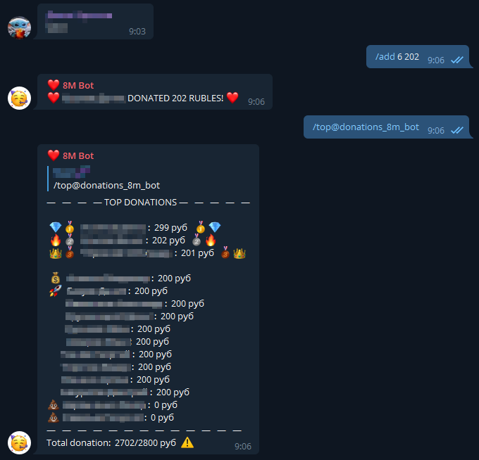

# Telegram-bots
 Telegram Bots

## 📖 Categories and Bots

  - [OSINT](#-OSINT)
    - [getcontact-telegram-bot](#getcontact-telegram-bot)
  - [4 Fun](#-4-fun)
    - [gaybot](#gaybot)
  - [Donations](#-donations)
    - [8M Bot](#8m-bot)

----

## [↑](#-categories-and-bots) OSINT
### [getcontact-telegram-bot](https://github.com/v1a0/getcontact-telegram-bot)
GetContact API realization as Telegram bot

----

## [↑](#-categories-and-bots) 4 Fun
### [Gaybot](https://github.com/v1a0/gaybot-telegram-bot)
Funny bot to count Gay Points, then more some user using G-words then more G-point it have.

----

## [↑](#-categories-and-bots) Donations
### [8M Bot](https://github.com/v1a0/8m-telegram-bot)
Simple bot for collecting money for gifts at 8 March into some group.

## License
[GNU GENERAL PUBLIC LICENSE](./LICENSE)
